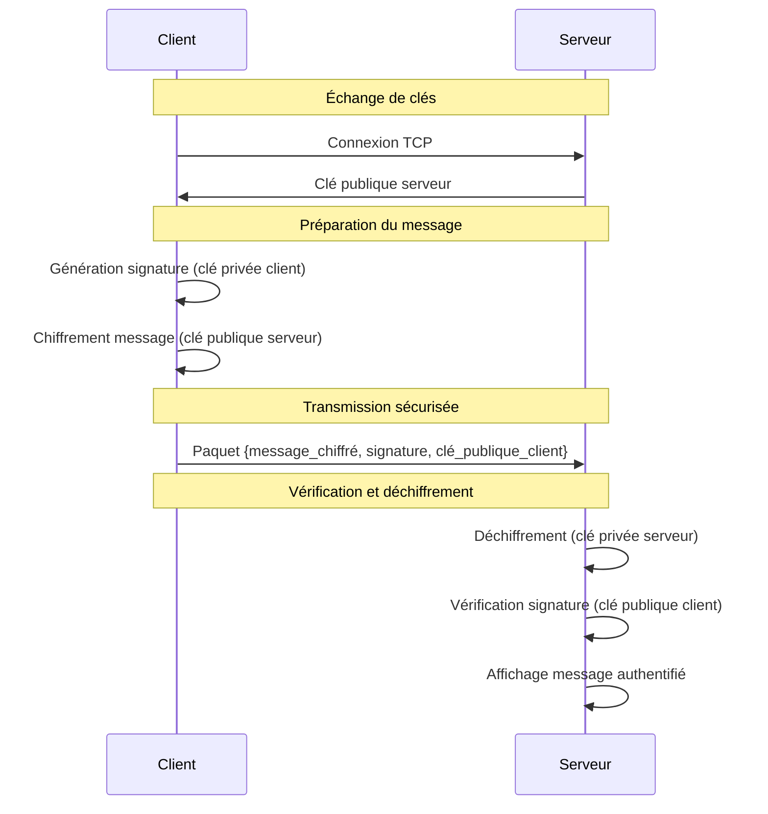

# Système de Communication Sécurisée

Un système de communication sécurisée implémenté en Python basé sur le modèle **Pretty Good Privacy (PGP)**, permettant l'échange de messages chiffrés et signés numériquement entre un client et un serveur.

## Objectif du Projet

Ce projet implémente un système de communication sécurisée qui démontre les principes fondamentaux de la cryptographie moderne :

- **Confidentialité** : Chiffrement des messages avec RSA
- **Authenticité** : Signature numérique pour vérifier l'expéditeur
- **Intégrité** : Détection de toute modification des données
- **Non-répudiation** : Preuve de l'origine du message

---

## ✨ Fonctionnalités

### 🖥️ Serveur PGP (`serveur.py`)

- ✅ Génération automatique de clés RSA (2048 bits)
- ✅ Écoute multi-clients sur socket TCP
- ✅ Déchiffrement des messages entrants
- ✅ Vérification automatique des signatures numériques
- ✅ Affichage sécurisé des messages authentifiés
- ✅ Gestion des erreurs et logs détaillés

### 📱 Client PGP (`client.py`)

- ✅ Génération de clés RSA uniques par session
- ✅ Signature numérique des messages (SHA-256 + RSA-PSS)
- ✅ Chiffrement avec la clé publique du serveur
- ✅ Interface utilisateur intuitive
- ✅ Mode test automatisé intégré
- ✅ Validation des données avant envoi

---

## 🛠️ Prérequis et Installation

### Prérequis Système

- **Python 3.7+** (testé avec Python 3.8-3.11)
- **Système d'exploitation** : Windows, macOS, Linux

### Installation des Dépendances

```bash
# Installation de la bibliothèque cryptographique
pip install cryptography
```

---

## 🚀 Utilisation

### Démarrage du Serveur

```bash
# Terminal 1
python serveur.py
```

**Sortie attendue :**
```
🔐 Serveur PGP initialisé
📋 Clés RSA générées (2048 bits)
🌐 Écoute sur localhost:8888
⏳ En attente de connexions...
```

### Démarrage du Client

```bash
# Terminal 2
python client.py
```

**Interface client :**
```
📱 Client PGP 🔐
Client PGP initialisé pour localhost:8888
📋 Clés RSA du client générées avec succès

💬 Que souhaitez-vous faire ?
1. Envoyer un message sécurisé
2. Quitter

👉 Votre choix (1-2): 1
✍️ Entrez votre message: Bonjour, message secret!
```

### Mode Test Automatisé

Pour tester rapidement le système, décommentez la ligne dans `client.py` :

```python
if __name__ == "__main__":
    test_rapide()  # Décommentez cette ligne
    # main()       # Commentez celle-ci
```

---

## 🔒 Architecture de Sécurité

### Algorithmes Utilisés

| Composant | Algorithme | Détails |
|-----------|------------|---------|
| **Chiffrement asymétrique** | RSA-2048 | Clés de 2048 bits, exposant 65537 |
| **Padding de chiffrement** | OAEP | Optimal Asymmetric Encryption Padding |
| **Fonction de hachage** | SHA-256 | Pour l'intégrité et la signature |
| **Signature numérique** | RSA-PSS | Probabilistic Signature Scheme |
| **Transport** | TCP Socket | Communication réseau sécurisée |

### Processus de Communication Sécurisée



---

## 📁 Structure du Projet

```
systeme-pgp/
├── serveur.py          # Serveur PGP principal
├── client.py           # Client PGP avec interface utilisateur
├── README.md           # Documentation (ce fichier)
├── requirements.txt    # Dépendances Python (optionnel)
└── examples/           # Exemples et tests (optionnel)
    ├── test_simple.py
    └── demo_messages.txt
```

---

## 🔧 Configuration

### Paramètres Modifiables

**Dans `serveur.py` :**
```python
# Configuration réseau
HOST = 'localhost'      # Adresse d'écoute
PORT = 8888            # Port d'écoute

# Configuration cryptographique
KEY_SIZE = 2048        # Taille des clés RSA
```

**Dans `client.py` :**
```python
# Configuration serveur cible
SERVER_HOST = 'localhost'
SERVER_PORT = 8888

# Messages de test prédéfinis
messages_test = [
    "Votre message personnalisé",
    "Autre message de test"
]
```

### Utilisation sur Réseau Local

Pour utiliser le système sur un réseau local :

1. **Serveur** : Modifiez `HOST = '0.0.0.0'` dans `serveur.py`
2. **Client** : Modifiez `SERVER_HOST = 'IP_DU_SERVEUR'` dans `client.py`
3. **Firewall** : Assurez-vous que le port 8888 est ouvert

---

## 🧪 Tests et Démonstration

### Test de Base

```bash
# Terminal 1
python serveur.py

# Terminal 2
python client.py
# Suivez l'interface pour envoyer un message
```

### Test Automatisé

```bash
# Modifiez client.py pour activer test_rapide()
python client.py
```

### Vérification des Composants

**Test de génération de clés :**
```python
python -c "
from cryptography.hazmat.primitives.asymmetric import rsa
cle = rsa.generate_private_key(public_exponent=65537, key_size=2048)
print(f'✅ Clé générée: {cle.key_size} bits')
"
```

**Test de signature :**
```python
# Testez la signature dans un script séparé
import hashlib
from cryptography.hazmat.primitives.asymmetric import rsa, padding
from cryptography.hazmat.primitives import hashes

# Test complet de signature/vérification
message = "Test de signature"
cle_privee = rsa.generate_private_key(public_exponent=65537, key_size=2048)

# ... (voir le code source pour l'implémentation complète)
```

---

## 📚 Concepts Pédagogiques

Ce projet illustre les concepts suivants :

### 🔐 Cryptographie Asymétrique (RSA)

- **Principe** : Une paire de clés (publique/privée) par utilisateur
- **Usage** : Chiffrement avec clé publique, déchiffrement avec clé privée
- **Avantage** : Pas besoin d'échange préalable de secret

### ✍️ Signature Numérique

- **Principe** : Signature avec clé privée, vérification avec clé publique
- **Usage** : Garantir l'authenticité et la non-répudiation
- **Processus** : Hash du message → Signature du hash → Vérification

### 🛡️ Modèle de Sécurité PGP

- **Confidentialité** : Seul le destinataire peut lire
- **Authenticité** : Vérification de l'expéditeur
- **Intégrité** : Détection des modifications
- **Non-répudiation** : Preuve de l'origine

### 🌐 Communication Réseau Sécurisée

- **Transport** : Socket TCP pour la fiabilité
- **Sérialisation** : Empaquetage des données complexes
- **Gestion d'erreurs** : Robustesse des communications
