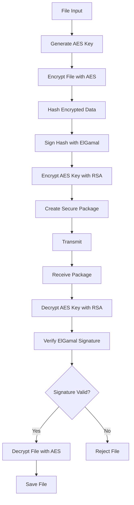
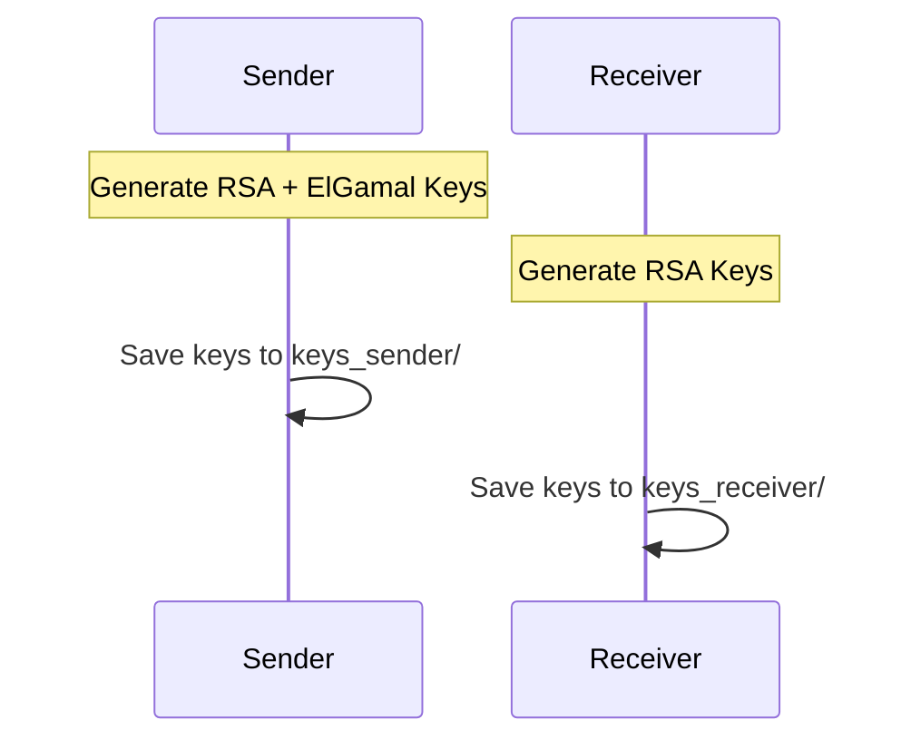
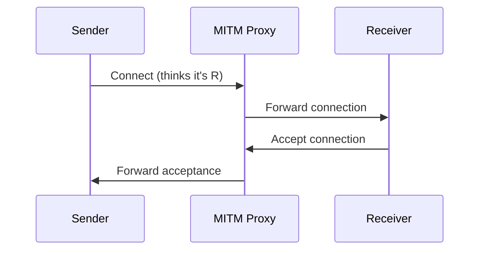
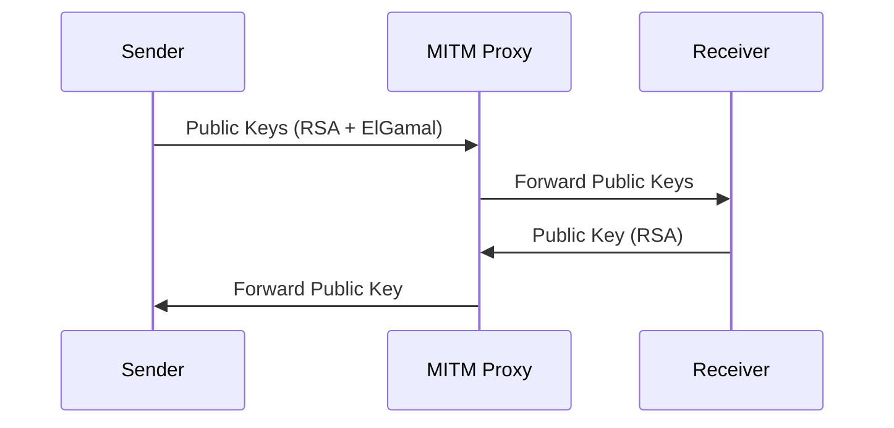
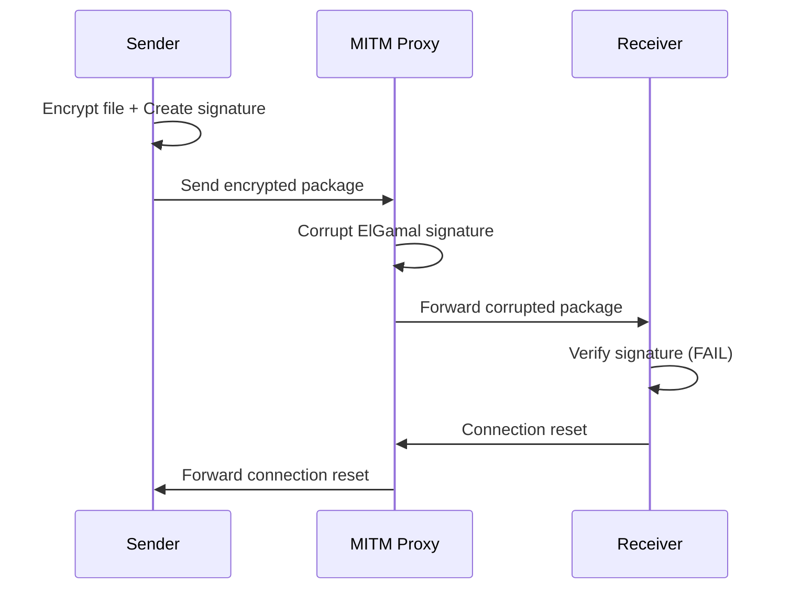

# Secure File Transfer with MITM Vulnerability Demonstration

[](https://python.org)
[](LICENSE)
[]()

## 📋 Table of Contents

- [Overview](#overview)
- [Architecture](#architecture)
- [Security Features](#security-features)
- [Vulnerability Demonstration](#vulnerability-demonstration)
- [Installation](#installation)
- [Usage](#usage)
- [Protocol Flow](#protocol-flow)
- [Attack Analysis](#attack-analysis)
- [Results](#results)
- [Security Recommendations](#security-recommendations)
- [Contributing](#contributing)

## 🎯 Overview

This project demonstrates a **hybrid cryptographic file transfer system** with an intentional vulnerability to **Man-in-the-Middle (MITM) attacks** targeting ElGamal digital signatures. The system serves as an educational tool to understand:

- Hybrid encryption implementations
- Digital signature vulnerabilities
- MITM attack vectors
- Cryptographic protocol security analysis

### 🏗️ System Components

| Component | Purpose | Technology |
|-----------|---------|------------|
| **Sender** | File encryption and transmission | AES-256 + RSA-2048 + ElGamal |
| **Receiver** | File decryption and verification | RSA-2048 + ElGamal verification |
| **MITM Proxy** | Attack demonstration | Signature corruption |

## 🏛️ Architecture

```
┌─────────────┐     ┌──────────────┐     ┌─────────────┐
│   SENDER    │────▶│  MITM PROXY  │────▶│  RECEIVER   │
│             │     │              │     │             │
│ • Encrypt   │     │ • Intercept  │     │ • Decrypt   │
│ • Sign      │     │ • Corrupt    │     │ • Verify    │
│ • Send      │     │ • Forward    │     │ • Accept    │
└─────────────┘     └──────────────┘     └─────────────┘
```

### 📁 Project Structure

```
secure_file_transfer/
├── 📄 README.md
├── 🐍 sender.py              # File sender application
├── 🐍 receiver.py            # File receiver application  
├── 🐍 mitm_proxy.py          # MITM attack proxy
├── 📁 keys_sender/           # Sender's cryptographic keys
├── 📁 keys_receiver/         # Receiver's cryptographic keys
├── 📁 received_files/        # Decrypted received files
└── 📄 requirements.txt       # Python dependencies
```

## 🔐 Security Features

### Encryption Layer
- **AES-256-CBC**: Symmetric encryption for file contents
- **RSA-2048**: Asymmetric encryption for AES key exchange
- **PKCS1-OAEP padding**: Enhanced RSA security

### Authentication Layer
- **ElGamal Digital Signatures**: Message authenticity
- **SHA-256 Hashing**: Data integrity verification
- **Public Key Exchange**: Identity verification

### Security Flow Diagram



## 🎯 Vulnerability Demonstration

### Attack Vector: ElGamal Signature Corruption

The MITM proxy demonstrates a targeted attack on the ElGamal signature verification process:

```
Normal Flow:
Sender → [Encrypted File + Valid Signature] → Receiver ✅

MITM Attack:
Sender → [Encrypted File + Valid Signature] → MITM → [Encrypted File + Corrupted Signature] → Receiver ❌
```

### Attack Mechanism

1. **Interception**: Proxy captures the encrypted package
2. **Signature Identification**: Locates ElGamal signature bytes
3. **Targeted Corruption**: Modifies specific signature bytes
4. **Forwarding**: Sends corrupted package to receiver
5. **Detection**: Receiver detects invalid signature and rejects

## 🚀 Installation

### Prerequisites

```bash
# Python 3.6 or higher
python3 --version

# Virtual environment (recommended)
python3 -m venv venv
source venv/bin/activate  # Linux/Mac
# venv\Scripts\activate   # Windows
```

### Dependencies

```bash
# Install required packages
pip install cryptography

# Or use requirements file
pip install -r requirements.txt
```

### Initial Setup

```bash
# Clone or download the project
git clone <repository-url>
cd secure_file_transfer

# Create necessary directories
mkdir -p keys_sender keys_receiver received_files

# Make scripts executable (Linux/Mac)
chmod +x *.py
```

## 💻 Usage

### Step 1: Start the Receiver

```bash
python3 receiver.py --port 9999 --key-dir keys_receiver
```

**Expected Output:**
```
🔑 Generating RSA keys...
🔑 Keys saved to keys_receiver/
🌐 Waiting for a connection on port 9999...
```

### Step 2: Start the MITM Proxy

```bash
python3 mitm_proxy.py
```

**Expected Output:**
```
============================================================
[MITM] Proxy MITM actif – Mode : corruption de signature ElGamal
[MITM] Écoute sur : 0.0.0.0:9998
[MITM] Redirige vers : 192.168.159.129:9999
============================================================
```

### Step 3: Send a File

```bash
# Create a test file
echo "This is a test file for secure transfer." > test.txt

# Send the file
python3 sender.py test.txt --host 192.168.159.128 --port 9998 --key-dir keys_sender
```

### Command Line Options

| Script | Option | Description | Default |
|--------|--------|-------------|---------|
| `sender.py` | `filename` | File to send | Required |
| | `--host` | Target host | `localhost` |
| | `--port` | Target port | `9999` |
| | `--key-dir` | Keys directory | `keys_sender` |
| | `--new-keys` | Force new key generation | `False` |
| `receiver.py` | `--port` | Listen port | `9999` |
| | `--key-dir` | Keys directory | `keys_receiver` |
| | `--new-keys` | Force new key generation | `False` |
| `mitm_proxy.py` | No options | Uses hardcoded values | - |

## 🔑 Key Management

Both scripts support flexible key management to maintain consistent cryptographic identities across multiple sessions:

### 🔧 Receiver Key Management

```bash
# Use existing keys (or generate if they don't exist)
python receiver.py --port 9999

# Force generation of new keys
python receiver.py --port 9999 --new-keys

# Store keys in a custom directory
python receiver.py --port 9999 --key-dir my_keys
```

### 📤 Sender Key Management

```bash
# Use existing keys (or generate if they don't exist)
python sender.py file.txt --host 192.168.1.100

# Force generation of new keys
python sender.py file.txt --host 192.168.1.100 --new-keys

# Store keys in a custom directory
python sender.py file.txt --host 192.168.1.100 --key-dir my_keys
```

### 🗂️ Key Directory Structure

When keys are generated, the following structure is created:

```
keys_sender/
├── 🔐 private_key.pem      # RSA private key
├── 🔓 public_key.pem       # RSA public key
├── 🔐 elgamal_private.pem  # ElGamal private key
└── 🔓 elgamal_public.pem   # ElGamal public key

keys_receiver/
├── 🔐 private_key.pem      # RSA private key
└── 🔓 public_key.pem       # RSA public key
```

### 💡 Key Management Best Practices

| Scenario | Recommended Approach |
|----------|---------------------|
| **First Run** | Let scripts auto-generate keys |
| **Development** | Use `--key-dir dev_keys` for testing |
| **Production** | Use `--key-dir prod_keys` with proper permissions |
| **Key Rotation** | Use `--new-keys` flag periodically |
| **Multiple Users** | Use different `--key-dir` for each user |

## 🔄 Protocol Flow

### 1. Key Generation Phase



### 2. Connection Establishment



### 3. Key Exchange



### 4. File Transfer with Attack



## 🔍 Attack Analysis

### Vulnerability Details

| Aspect | Details |
|--------|---------|
| **Target** | ElGamal digital signature |
| **Method** | Byte-level corruption |
| **Detection** | Signature verification failure |
| **Impact** | Denial of service (file rejection) |

### Attack Signature

The proxy corrupts specific bytes in the ElGamal signature:

```python
# Example corruption pattern
original_bytes = [0xfa, 0xc5, 0x2d, 0x5b, 0x31]
corrupted_bytes = [0x50, 0x6f, 0x87, 0xf1, 0x9b]
```

### Security Implications

1. **Integrity Compromise**: Data authenticity cannot be verified
2. **Availability Impact**: Legitimate files are rejected
3. **Detection Capability**: System correctly identifies tampering
4. **Cryptographic Weakness**: ElGamal implementation vulnerable to corruption

## 📊 Results

### Successful Attack Output

#### MITM Proxy Console
```
[MITM] Message → Serveur (1608 octets)
[MITM] → Détection des métadonnées (avec signature). Corruption...
[ATTACK] Octet 30 : 0xfa → 0x50
[ATTACK] Octet 31 : 0xc5 → 0x6f
[ATTACK] Octet 32 : 0x2d → 0x87
[ATTACK] Octet 33 : 0x5b → 0xf1
[ATTACK] Octet 34 : 0x31 → 0x9b
```

#### Receiver Console
```
🔗 Connection established with 192.168.159.128:52698
🔑 Key exchange completed. Waiting for file...
❌ Error receiving file: Decryption failed
🌐 Waiting for a connection...
```

#### Sender Console
```
🔑 Loading keys from keys_sender/...
🌐 Connecting to 192.168.159.128:9998...
🔄 Exchanging public keys...
📤 Sending file: test.txt
❌ Error: Connection reset by peer
```

## 🛡️ Security Recommendations

### For Production Systems

1. **Transport Layer Security**
   ```
   Implement TLS/SSL for end-to-end encryption
   Use certificate pinning for authentication
   ```

2. **Modern Cryptographic Algorithms**
   ```
   Replace ElGamal with ECDSA or Ed25519
   Use authenticated encryption (AES-GCM)
   Implement perfect forward secrecy
   ```

3. **Additional Security Measures**
   ```
   Multi-factor authentication
   Message sequence numbers
   Timestamp validation
   Certificate revocation checking
   ```

4. **Network Security**
   ```
   VPN or secure tunneling
   Network segmentation
   Intrusion detection systems
   Traffic analysis prevention
   ```

### Code Improvements

```python
# Example: Enhanced signature verification
def verify_signature_enhanced(data, signature, public_key, timestamp):
    # Verify timestamp freshness
    if not is_timestamp_valid(timestamp):
        return False
    
    # Use modern signature algorithm
    try:
        public_key.verify(signature, data, padding.PSS(...))
        return True
    except InvalidSignature:
        return False
```

## 🤝 Contributing

We welcome contributions to improve this educational project:

1. **Fork** the repository
2. **Create** a feature branch (`git checkout -b feature/improvement`)
3. **Commit** changes (`git commit -am 'Add improvement'`)
4. **Push** to branch (`git push origin feature/improvement`)
5. **Create** a Pull Request

### Areas for Contribution

- Additional attack vectors
- Modern cryptographic implementations
- Better error handling
- Performance optimizations
- Documentation improvements

## 📚 Educational Value

This project demonstrates:

- **Cryptographic Protocol Design**: Understanding hybrid encryption
- **Vulnerability Research**: Identifying attack vectors
- **Security Analysis**: Evaluating cryptographic implementations
- **Network Security**: MITM attack techniques
- **Defensive Programming**: Proper signature verification

## ⚠️ Disclaimer

**FOR EDUCATIONAL PURPOSES ONLY**

This project is designed for learning and research purposes. Do not use this code in production environments or for malicious activities. The demonstrated vulnerability is intentional and serves to illustrate important security concepts.
